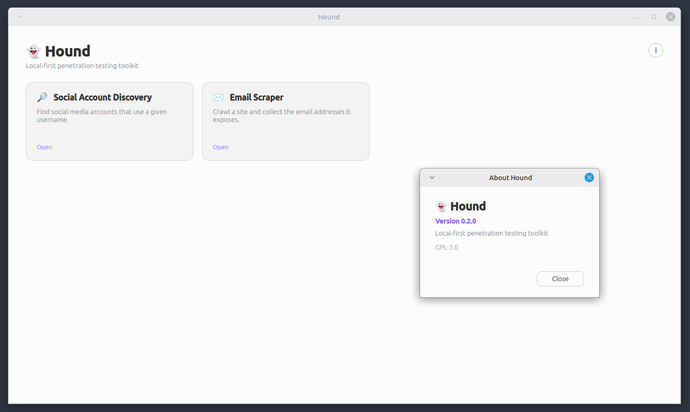

# 👻 Hound

Local-first penetration testing toolkit consisting of many tools, e.g. username to
social accounts.

Hound is a desktop app. The home screen lists the tools as cards, and each tool opens
its own page. Everything runs on your machine, there is no backend and no account.



## Features

- **Social account discovery.** Give it a username and it checks 27 public sites for a
  profile. Sites are checked concurrently, results appear as they arrive, and hits show
  a clickable profile link. A site that blocks or rate limits the request is reported as
  unknown, never as not found.
- **Email Scraper.** Point it at a URL and it crawls publicly accessible pages to
  collect email addresses, including addresses encoded by common HTML obfuscation
  mechanisms such as the one Cloudflare serves publicly. Stays on the starting domain by
  default, with an adjustable page limit and a stop button. Results appear while the
  crawl runs.
- **theHarvester** (coming soon). Emails, subdomains, and hosts from public sources.
- **hunter.io** (coming soon). Email lookup by domain.

## Requirements

- Python 3.12. Tested on 3.12.3.
- Linux, macOS, or Windows. Developed on Linux with X11.
- On Linux, the system package `libxcb-cursor0`. Qt needs it since 6.5 and will not
  start without it.

```bash
sudo apt install -y libxcb-cursor0
```

Python packages are in `requirements.txt`: PySide6, requests, beautifulsoup4
and lxml.

## Running

```bash
git clone https://github.com/AlbertArakelyan/Hound
cd Hound
python3 -m venv .venv
source .venv/bin/activate
pip install -r requirements.txt
python main.py
```

## Development

Work inside the venv. Read `SPEC.md` for the design and `CLAUDE.md` for the rules.

The lookup engines hold no Qt imports, so you can test them with no display:

```bash
python -c "
from hound.tools.social_accounts.lookup import scan
for r in scan('torvalds'):
    print(r.status.value, r.site, r.url)
"
```

To check GUI wiring without opening a window, run Qt's offscreen backend:

```bash
QT_QPA_PLATFORM=offscreen python -c "
from PySide6.QtWidgets import QApplication
from hound.ui.main_window import MainWindow
app = QApplication(['test'])
MainWindow().show()
print('ok')
"
```

### Layout

```
main.py                     starts the app
hound/app.py                QApplication setup
hound/ui/                   navigation, home screen, shared widgets
hound/tools/registry.py     the tool list the home screen reads
hound/tools/<tool>/         one directory per tool, logic split from UI
```

Adding a tool means a new directory plus one registry entry. The home screen does not
change.

## Scope

For authorized security testing only. Hound reads publicly served pages. It does not
attempt logins, and it does not defeat authentication or any other access control. The
email obfuscation it decodes is a display trick the site itself serves to every visitor,
not a security boundary.

You are responsible for having permission to test what you point it at, and for
respecting the target's terms of service, its rate limits, and any privacy law that
applies to addresses you collect.

Do not use Hound to collect personal data at scale, evade rate limits, or conduct
unsolicited outreach. Email addresses are personal data in most jurisdictions, and
collecting them is not the same as being allowed to use them.

To report a vulnerability in Hound, or a case of someone abusing it, see
[SECURITY.md](SECURITY.md).

## License

MIT. See [LICENSE](LICENSE).

Copyright (c) 2026 Albert Arakelyan.

### Third-party licenses

Hound's own code is MIT. Its dependencies keep their own licenses:

| package | license |
|---|---|
| PySide6 | LGPL-3.0 (also available commercially from The Qt Company) |
| requests | Apache-2.0 |
| beautifulsoup4 | MIT |
| lxml | BSD-3-Clause |

PySide6 is used under the LGPL-3.0, which is what lets Hound itself be MIT. The LGPL
applies to PySide6, not to Hound. Two things follow from it:

- You can replace the PySide6 that Hound uses with your own build. Installing from
  `requirements.txt` into your own environment already gives you that.
- If Hound is ever shipped as a frozen binary, the Qt libraries have to stay separate and
  replaceable, not statically linked.

Qt's licensing terms are at <https://www.qt.io/licensing>, and the LGPL-3.0 text is at
<https://www.gnu.org/licenses/lgpl-3.0.html>.
